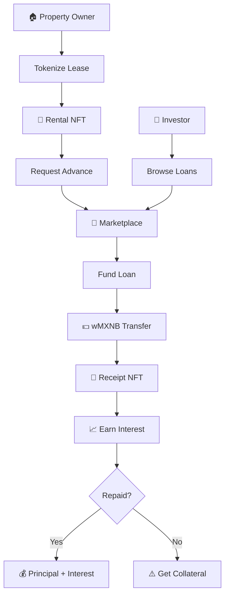

<div align="center">

# 🏠 RoomLen

### Unlock Liquidity from Rental Agreements

**Convert signed leases into instant capital on Polkadot**

[](https://blockscout-passet-hub.parity-testnet.parity.io/address/0x6Bd6fD3114dc7BB3b5bD137A51F474e78D065bA4)
[](Foundry/test/)
[](.)

**Built from** 🇲🇽 **Mexico &** 🇧🇴 **Bolivia** | *"Live. Rent. Earn."*

[🎬 Demo](#-quick-demo) • [💡 Features](#-key-features) • [🏗️ Architecture](#%EF%B8%8F-architecture) • [🧪 Test It](#-test-the-platform)

</div>

---

## 💡 What is RoomLen?

**RoomLen** transforms **$50B+ locked in Latin American rental agreements** into instant liquidity. Property owners get **80-90% of future rent upfront**, while investors earn **15-28% APR** through secure, blockchain-backed lending.

### 🎯 The Problem

In LATAM, traditional lending is:
- ⏰ **Slow:** 2-4 weeks approval
- 💸 **Expensive:** 30-50% interest rates
- 📄 **Complex:** Mountains of paperwork

### ✨ Our Solution

RoomLen provides:
- ⚡ **Instant** liquidity from signed leases
- 📊 **Fair rates:** 15-28% APR based on AI risk scoring
- 🔒 **Secure:** Smart contract escrow on Polkadot
- 🎫 **Composable:** NFT-based positions (tradeable)

---

## 🚀 Key Features

<table>
<tr>
<td width="50%">

### 🏠 For Property Owners
- 🎫 **Tokenize** rental agreements as NFTs
- ⚡ **Get 80-90%** of future rent upfront
- 📊 **AI scoring** for best rates
- 🔗 **Blockchain-secured** agreements

</td>
<td width="50%">

### 💼 For Investors
- 📈 **Earn 15-28% APR** on secured loans
- 🛒 **Browse marketplace** of opportunities
- 💱 **Trade positions** via NFTs
- 🤖 **Auto-liquidation** protection

</td>
</tr>
</table>

### Risk-Based Pricing

| Tier | Credit Score | APR | Max LTV | Haircut |
|:----:|:------------:|:---:|:-------:|:-------:|
| 🟢 **A** | 80-100 | 15% | 90% | 10% |
| 🟡 **B** | 60-79 | 20% | 85% | 15% |
| 🔴 **C** | 40-59 | 28% | 78% | 22% |

**Example:** 12-month lease @ $5,000/mo = **$49,090 instant advance** (Tier A)

---

## 🏗️ Architecture



### Smart Contract Stack

```
┌─────────────────────────────────────┐
│      LendingProtocol (Core)        │
│   • requestLoan()  • fundLoan()    │
│   • repayLoan()    • liquidate()   │
└──────────┬──────────┬───────┬──────┘
           │          │       │
      ┌────▼───┐ ┌───▼────┐ ┌▼─────┐
      │Rental  │ │Receipt │ │wMXNB │
      │  NFT   │ │  NFT   │ │Token │
      └────────┘ └────────┘ └──────┘
              │
         ┌────▼─────────────────┐
         │  Paseo Testnet       │
         │  (Polkadot Asset Hub)│
         └──────────────────────┘
```

---

## 📜 Deployed Contracts

### 🌐 Network: Paseo Testnet (Polkadot)

| Contract | Address | Explorer |
|:---------|:--------|:--------:|
| **🏦 LendingProtocol** | `0x6Bd6fD...5bA4` | [View ↗](https://blockscout-passet-hub.parity-testnet.parity.io/address/0x6Bd6fD3114dc7BB3b5bD137A51F474e78D065bA4) |
| **🏠 RentalNFT** | `0x9a340C...2b97` | [View ↗](https://blockscout-passet-hub.parity-testnet.parity.io/address/0x9a340Cd35537C05ec78b41064D99d15fb08e2b97) |
| **🎫 ReceiptNFT** | `0xC542E3...A65545` | [View ↗](https://blockscout-passet-hub.parity-testnet.parity.io/address/0xC542E39374e63836B2307034E29cceE435A65545) |
| **💵 wMXNB** | `0x7EF455...5F3D` | [View ↗](https://blockscout-passet-hub.parity-testnet.parity.io/address/0x7EF4558fe6E4c3Db239Bb763664A452F23955F3D) |
| **🔐 Escrow** | `0xb2dE36...7d0` | [View ↗](https://blockscout-passet-hub.parity-testnet.parity.io/address/0xb2dE3684E6A452f142FD87AbA0B2B190059c27d0) |

<details>
<summary>📋 Network Configuration</summary>

```json
{
  "chainName": "Paseo Testnet",
  "chainId": 420420422,
  "rpcUrl": "https://testnet-passet-hub-eth-rpc.polkadot.io",
  "nativeCurrency": { "name": "PAS", "symbol": "PAS", "decimals": 18 },
  "blockExplorer": "https://blockscout-passet-hub.parity-testnet.parity.io",
  "faucet": "https://faucet.polkadot.io/paseo"
}
```
</details>

---

## 🧪 Test the Platform

### Option 1: Live Demo (Easiest) ⚡

```bash
# 1. Clone & Install
git clone https://github.com/hackatonmxnb/roomlen-web.git
cd roomlen-web
npm install

# 2. Run
npm run dev
```

**Then:**
1. Open http://localhost:3000
2. Connect wallet to **Paseo Testnet** ([Add to MetaMask](https://chainlist.org/?testnets=true&search=paseo))
3. Get **PAS tokens** from [faucet](https://faucet.polkadot.io/paseo)
4. Get **wMXNB tokens** (testnet currency) - use faucet on homepage
5. **Test the flow:**
   - 🏠 **Owner:** `/owner` → Tokenize → Get Advance
   - 💼 **Investor:** `/investor` → Browse → Fund Loans

### Option 2: Direct Contract Interaction

```bash
# View loans on-chain
cast call 0x6Bd6fD3114dc7BB3b5bD137A51F474e78D065bA4 \
  "getLoansCount()" \
  --rpc-url https://testnet-passet-hub-eth-rpc.polkadot.io

# View risk tiers
cast call 0x6Bd6fD3114dc7BB3b5bD137A51F474e78D065bA4 \
  "getRiskTiers()" \
  --rpc-url https://testnet-passet-hub-eth-rpc.polkadot.io
```

### Option 3: Run Smart Contract Tests

```bash
cd Foundry
forge test -vvv
```

**Result:** ✅ **9/9 tests passing**

---

## 🎬 Quick Demo

### User Flow: Owner Dashboard

```
1. Connect wallet → Paseo Testnet
2. See demo properties (3 pre-populated)
3. Click "Tokenize" → Creates Rental NFT on-chain
4. Click "Get Advance" → AI analyzes & calculates offer
5. Click "Publish to Marketplace" → Loan request goes live
```

### User Flow: Investor Dashboard

```
1. Connect wallet → See marketplace
2. Browse loan opportunities (Primary + Secondary market)
3. Filter by: Risk tier, Term, APR
4. Click "Fund" → Transfer wMXNB → Receive Receipt NFT
5. Track returns in Portfolio tab
```

---

## 🛠️ Tech Stack

<div align="center">


</div>

**Smart Contracts:** Solidity • OpenZeppelin • Foundry • ERC-721
**Frontend:** Next.js • TypeScript • Tailwind CSS • ethers.js • viem
**Blockchain:** Polkadot Paseo Testnet (EVM-compatible)

---

## 📁 Project Structure

```
roomlen-web/
├── src/
│   ├── app/
│   │   ├── page.tsx              # 🏠 Landing page
│   │   ├── owner/page.tsx        # 🏠 Owner dashboard
│   │   └── investor/page.tsx     # 💼 Investor dashboard
│   ├── components/
│   │   ├── investor/             # Marketplace, Portfolio, Filters
│   │   ├── owner/                # Tokenization, Advance flow
│   │   └── ui/                   # Shared UI components
│   └── lib/
│       ├── contractAddresses.ts  # Deployed addresses
│       └── abi/                  # Contract ABIs
├── Foundry/
│   ├── src/                      # 📜 Solidity contracts
│   │   ├── LendingProtocol.sol
│   │   ├── VerifiableRentalAgreementNFT.sol
│   │   ├── TokenReciboRoomlen.sol
│   │   ├── wMXNB.sol
│   │   └── SecondaryMarket.sol
│   ├── script/                   # Deployment scripts
│   └── test/                     # ✅ Contract tests (9/9 passing)
└── scripts/
    └── liquidationBot.ts         # 🤖 Auto-liquidation bot
```

---

## 🔒 Security

### ✅ Smart Contract Security Features

- **OpenZeppelin** libraries (battle-tested)
- **ReentrancyGuard** on all state-changing functions
- **SafeERC20** for secure token transfers
- **Ownable** access control
- **Comprehensive tests** (9/9 passing)

### ⚠️ Limitations (Testnet MVP)

This is a **hackathon prototype** on testnet. **Not audited. Not for production.**

- KYC/AML: Planned but not implemented
- Oracle integration: Simulated
- Emergency pause: Not implemented
- Risk scoring: Simplified AI model

---

## 🗺️ Roadmap

### ✅ Phase 1: MVP (Current)
- Core smart contracts on Paseo
- Owner & Investor dashboards
- P2P lending marketplace
- Secondary market for NFTs
- Liquidation bot

### 🔄 Phase 2: Beta (Q2 2025)
- [ ] Mainnet deployment (Moonbeam/Asset Hub)
- [ ] KYC/AML integration
- [ ] Advanced risk scoring with oracles
- [ ] Multi-currency support (USDC, USDT)

### 🚀 Phase 3: Scale (Q3-Q4 2025)
- [ ] Pooled lending (ERC-4626 vault)
- [ ] Mobile app (React Native)
- [ ] Expansion to 3 LATAM countries
- [ ] Institutional partnerships

---

## 📄 License

**MIT License** - See [LICENSE](LICENSE) for details

---

## 🔗 Links

<div align="center">

[](https://github.com/hackatonmxnb/roomlen-web)
[](https://blockscout-passet-hub.parity-testnet.parity.io/address/0x6Bd6fD3114dc7BB3b5bD137A51F474e78D065bA4)
[](https://faucet.polkadot.io/paseo)

[📧 Contact](mailto:contact@roomlen.io) • [🐦 Twitter](https://twitter.com/roomlen) • [💬 Discord](https://discord.gg/roomlen)

</div>

---

<div align="center">

### LATIN HACK 2025 Submission

**RoomLen** - *Unlocking LATAM's $50B rental economy*

**"Live. Rent. Earn."**

Made with from 🇲🇽 🇧🇴

</div>
