<div align="center">

# 🏠 RoomLen

### Unlock Liquidity from Rental Agreements

**Convert signed leases into instant capital on Base**

[](https://roomlen.netlify.app/)
[](https://sepolia.basescan.org/address/0xeD9018D47ee787C5d84A75A42Df786b8540cC75b)
[](Foundry/test/)
[](.)

<div align="center" style="background: linear-gradient(135deg, #0052FF 0%, #1652F0 100%); padding: 20px; border-radius: 10px; margin: 20px 0;">

### 🌐 **[→ TRY LIVE DEMO NOW ←](https://roomlen.netlify.app/)**
**No installation needed • Connect wallet • Start testing in 2 minutes**

</div>

**Built from** 🇲🇽 **Mexico &** 🇧🇴 **Bolivia** | *"Live. Rent. Earn."*

[🎬 Demo](#-quick-demo) • [💡 Features](#-key-features) • [🏗️ Architecture](#%EF%B8%8F-architecture) • [🧪 Test It](#-test-the-platform)

</div>

---

## 🎯 Quick Start for Judges

<div align="center">

### 🌐 **LIVE APP:** [**roomlen.netlify.app**](https://roomlen.netlify.app/)

### ⚡ **Network Used:** Base Sepolia Testnet (Optimism L2)

</div>

### 📍 **Main Contract Address**
```
0xeD9018D47ee787C5d84A75A42Df786b8540cC75b
```
[**View on BaseScan** →](https://sepolia.basescan.org/address/0xeD9018D47ee787C5d84A75A42Df786b8540cC75b)

### 📄 **Contract ABIs**
Full ABIs available at: `Foundry/abis/` directory

<details>
<summary><b>🔗 All Deployed Contracts (Base Sepolia)</b></summary>

| Contract | Address | Explorer Link |
|:---------|:--------|:--------------|
| **LendingProtocol V2** | `0xeD9018D47ee787C5d84A75A42Df786b8540cC75b` | [View](https://sepolia.basescan.org/address/0xeD9018D47ee787C5d84A75A42Df786b8540cC75b) |
| **VRA-NFT V2** | `0x674687e09042452C0ad3D5EC06912bf4979bFC33` | [View](https://sepolia.basescan.org/address/0x674687e09042452C0ad3D5EC06912bf4979bFC33) |
| **TRR-NFT V2** | `0xF8F626afB4AadB41Be7D746e53Ff417735b1C289` | [View](https://sepolia.basescan.org/address/0xF8F626afB4AadB41Be7D746e53Ff417735b1C289) |
| **SecondaryMarket V2** | `0x9c2be1158ba6B8ED8B528B685058F743336b988F` | [View](https://sepolia.basescan.org/address/0x9c2be1158ba6B8ED8B528B685058F743336b988F) |
| **USDC (Base Sepolia)** | `0x036CbD53842c5426634e7929541eC2318f3dCF7e` | [View](https://sepolia.basescan.org/address/0x036CbD53842c5426634e7929541eC2318f3dCF7e) |
| **USDT (Base Sepolia)** | `0xf8b6097E8c1adFa8B2f37c5876Ed07E87Dcf2C3C` | [View](https://sepolia.basescan.org/address/0xf8b6097E8c1adFa8B2f37c5876Ed07E87Dcf2C3C) |

</details>

### 🧪 **How to Test the Project**

#### ⚡ Option A: Live Demo (FASTEST - 2 minutes)
**👉 Just visit:** **[roomlen.netlify.app](https://roomlen.netlify.app/)** 👈

Then:
1. Click **"Connect Wallet"** → Add Base Sepolia Network (automatic)
2. Get free **Base Sepolia ETH**: [Coinbase Faucet](https://www.coinbase.com/faucets/base-ethereum-goerli-faucet)
3. Get free **USDC** tokens (use faucet button on homepage or [Circle Faucet](https://faucet.circle.com/))
4. Test as **Owner** ([/owner](https://roomlen.netlify.app/owner)) or **Investor** ([/investor](https://roomlen.netlify.app/investor))

#### Option B: Run Locally (5 minutes)
```bash
# Clone and run
git clone https://github.com/hackatonmxnb/roomlen-web.git
cd roomlen-web
npm install
npm run dev
```
Then open http://localhost:3000 and follow steps above

#### Option C: Test Smart Contracts (2 minutes)
```bash
cd Foundry
forge test -vvv
```
**Result:** ✅ 9/9 tests passing

#### Option D: Direct Contract Calls
```bash
# Check total loans
cast call 0xeD9018D47ee787C5d84A75A42Df786b8540cC75b \
  "getLoansCount()" \
  --rpc-url https://sepolia.base.org

# View risk tiers
cast call 0xeD9018D47ee787C5d84A75A42Df786b8540cC75b \
  "getRiskTiers()" \
  --rpc-url https://sepolia.base.org

# Check supported tokens
cast call 0xeD9018D47ee787C5d84A75A42Df786b8540cC75b \
  "getSupportedTokens()" \
  --rpc-url https://sepolia.base.org
```

<div align="center">

### 🚀 **[→ OPEN LIVE APP NOW ←](https://roomlen.netlify.app/)**

</div>

---

## 💡 What is RoomLen?

**RoomLen** transforms **$50B+ locked in Latin American rental agreements** into instant liquidity. Property owners get **80-90% of future rent upfront**, while investors earn **15-28% APR** through secure, blockchain-backed lending.

### 🎯 The Problem

In LATAM, traditional lending is:
- ⏰ **Slow:** 2-4 weeks approval
- 💸 **Expensive:** 30-50% interest rates
- 📄 **Complex:** Mountains of paperwork

### ✨ Our Solution

RoomLen provides:
- ⚡ **Instant** liquidity from signed leases
- 📊 **Fair rates:** 15-28% APR based on AI risk scoring
- 🔒 **Secure:** Smart contract escrow on Polkadot
- 🎫 **Composable:** NFT-based positions (tradeable)

---

## 🚀 Key Features

<table>
<tr>
<td width="50%">

### 🏠 For Property Owners
- 🎫 **Tokenize** rental agreements as NFTs
- ⚡ **Get 80-90%** of future rent upfront
- 📊 **AI scoring** for best rates
- 🔗 **Blockchain-secured** agreements

</td>
<td width="50%">

### 💼 For Investors
- 📈 **Earn 15-28% APR** on secured loans
- 🛒 **Browse marketplace** of opportunities
- 💱 **Trade positions** via NFTs
- 🤖 **Auto-liquidation** protection

</td>
</tr>
</table>

### Risk-Based Pricing

| Tier | Credit Score | APR | Max LTV | Haircut |
|:----:|:------------:|:---:|:-------:|:-------:|
| 🟢 **A** | 80-100 | 15% | 90% | 10% |
| 🟡 **B** | 60-79 | 20% | 85% | 15% |
| 🔴 **C** | 40-59 | 28% | 78% | 22% |

**Example:** 12-month lease @ $5,000/mo = **$49,090 instant advance** (Tier A)

---

## 🏗️ Architecture

```mermaid
graph TB
    Owner[🏠 Property Owner] --> Tokenize[Tokenize Lease]
    Tokenize --> NFT[🎫 Rental NFT]
    NFT --> Request[Request Advance]
    Request --> Marketplace[🏪 Marketplace]

    Investor[💼 Investor] --> Browse[Browse Loans]
    Browse --> Marketplace
    Marketplace --> Fund[Fund Loan]
    Fund --> Transfer[💵 wMXNB Transfer]
    Transfer --> Receipt[🎫 Receipt NFT]

    Receipt --> Earn[📈 Earn Interest]
    Earn --> Repay{Repaid?}
    Repay -->|Yes| Return[💰 Principal + Interest]
    Repay -->|No| Liquidate[⚠️ Get Collateral]
```



### Smart Contract Stack

```
┌─────────────────────────────────────┐
│    LendingProtocol V2 (Core)       │
│   • requestLoan()  • fundLoan()    │
│   • repayLoan()    • liquidate()   │
│   • Multi-stablecoin support       │
└──────────┬──────────┬───────┬──────┘
           │          │       │
      ┌────▼───┐ ┌───▼────┐ ┌▼─────────┐
      │VRA-NFT │ │TRR-NFT │ │USDC/USDT │
      │   V2   │ │   V2   │ │  Tokens  │
      └────────┘ └────────┘ └──────────┘
              │
         ┌────▼──────────────────┐
         │  Base Sepolia         │
         │  (Optimism L2)        │
         └───────────────────────┘
```

---

## 📜 Deployed Contracts

### 🌐 Network: Base Sepolia Testnet (Optimism L2)

| Contract | Address | Explorer |
|:---------|:--------|:--------:|
| **🏦 LendingProtocol V2** | `0xeD9018...cC75b` | [View ↗](https://sepolia.basescan.org/address/0xeD9018D47ee787C5d84A75A42Df786b8540cC75b) |
| **🏠 VRA-NFT V2** | `0x674687...bFC33` | [View ↗](https://sepolia.basescan.org/address/0x674687e09042452C0ad3D5EC06912bf4979bFC33) |
| **🎫 TRR-NFT V2** | `0xF8F626...b1C289` | [View ↗](https://sepolia.basescan.org/address/0xF8F626afB4AadB41Be7D746e53Ff417735b1C289) |
| **🛒 SecondaryMarket V2** | `0x9c2be1...6b988F` | [View ↗](https://sepolia.basescan.org/address/0x9c2be1158ba6B8ED8B528B685058F743336b988F) |
| **💵 USDC** | `0x036CbD...dCF7e` | [View ↗](https://sepolia.basescan.org/address/0x036CbD53842c5426634e7929541eC2318f3dCF7e) |
| **💵 USDT** | `0xf8b609...Cf2C3C` | [View ↗](https://sepolia.basescan.org/address/0xf8b6097E8c1adFa8B2f37c5876Ed07E87Dcf2C3C) |

<details>
<summary>📋 Network Configuration</summary>

```json
{
  "chainName": "Base Sepolia",
  "chainId": 84532,
  "rpcUrl": "https://sepolia.base.org",
  "nativeCurrency": { "name": "ETH", "symbol": "ETH", "decimals": 18 },
  "blockExplorer": "https://sepolia.basescan.org",
  "faucet": "https://www.coinbase.com/faucets/base-ethereum-goerli-faucet"
}
```
</details>

---

## 🧪 Test the Platform

<div align="center">

## 🌐 **[TRY LIVE DEMO →](https://roomlen.netlify.app/)**

**No installation • No setup • Just connect wallet**

[](https://roomlen.netlify.app/)

</div>

### Option 1: Live Demo (Easiest) ⚡

**Just visit:** **[roomlen.netlify.app](https://roomlen.netlify.app/)**

**Then:**
1. Connect wallet to **Base Sepolia** (automatic network detection)
2. Get **Base Sepolia ETH** from [Coinbase Faucet](https://www.coinbase.com/faucets/base-ethereum-goerli-faucet)
3. Get **USDC tokens** - use faucet on homepage or [Circle Faucet](https://faucet.circle.com/)
4. **Test the flow:**
   - 🏠 **Owner:** [/owner](https://roomlen.netlify.app/owner) → Tokenize → Get Advance
   - 💼 **Investor:** [/investor](https://roomlen.netlify.app/investor) → Browse → Fund Loans

### Option 2: Run Locally

```bash
# 1. Clone & Install
git clone https://github.com/hackatonmxnb/roomlen-web.git
cd roomlen-web
npm install

# 2. Run
npm run dev
```
Then open http://localhost:3000

### Option 3: Direct Contract Interaction

```bash
# View loans on-chain
cast call 0xeD9018D47ee787C5d84A75A42Df786b8540cC75b \
  "getLoansCount()" \
  --rpc-url https://sepolia.base.org

# View risk tiers
cast call 0xeD9018D47ee787C5d84A75A42Df786b8540cC75b \
  "getRiskTiers()" \
  --rpc-url https://sepolia.base.org

# View supported tokens (USDC, USDT)
cast call 0xeD9018D47ee787C5d84A75A42Df786b8540cC75b \
  "getSupportedTokens()" \
  --rpc-url https://sepolia.base.org
```

### Option 4: Run Smart Contract Tests

```bash
cd Foundry
forge test -vvv
```

**Result:** ✅ **9/9 tests passing**

---

## 🎬 Quick Demo

### User Flow: Owner Dashboard

```
1. Connect wallet → Base Sepolia (automatic)
2. See demo properties (3 pre-populated)
3. Click "Tokenize" → Creates VRA-NFT V2 on-chain
4. Click "Get Advance" → AI analyzes & calculates offer with USDC/USDT
5. Click "Publish to Marketplace" → Loan request goes live
```

### User Flow: Investor Dashboard

```
1. Connect wallet → See marketplace
2. Browse loan opportunities (Primary + Secondary market)
3. Filter by: Risk tier, Term, APR, Token (USDC/USDT)
4. Click "Fund" → Transfer USDC/USDT → Receive TRR-NFT V2
5. Track returns in Portfolio tab
```

---

## 🛠️ Tech Stack

<div align="center">


</div>

**Smart Contracts:** Solidity 0.8.20 • OpenZeppelin • Foundry • ERC-721
**Frontend:** Next.js 15 • TypeScript • Tailwind CSS • Wagmi • Viem • OnchainKit
**Blockchain:** Base Sepolia Testnet (Optimism L2)

---

## 📁 Project Structure

```
roomlen-web/
├── src/
│   ├── app/
│   │   ├── page.tsx              # 🏠 Landing page
│   │   ├── owner/page.tsx        # 🏠 Owner dashboard
│   │   └── investor/page.tsx     # 💼 Investor dashboard
│   ├── components/
│   │   ├── investor/             # Marketplace, Portfolio, Filters
│   │   ├── owner/                # Tokenization, Advance flow
│   │   └── ui/                   # Shared UI components
│   └── lib/
│       ├── contractAddresses.ts  # Base Sepolia addresses
│       ├── wagmi.ts              # Wagmi config for Base
│       ├── OnchainProviders.tsx  # OnchainKit provider
│       └── abi/                  # Contract ABIs
├── Foundry/
│   ├── src/                      # 📜 Solidity contracts V2
│   │   ├── LendingProtocolV2.sol
│   │   ├── VerifiableRentalAgreementNFTV2.sol
│   │   ├── TokenReciboRoomlenV2.sol
│   │   └── SecondaryMarketV2.sol
│   ├── script/                   # Deployment scripts
│   │   └── DeployAllV2Base.s.sol # Deploy to Base
│   ├── deployments/              # Deployed contract info
│   └── abis/                     # Generated ABIs
└── scripts/
    └── liquidationBot.ts         # 🤖 Auto-liquidation bot
```

---

## 🔒 Security

### ✅ Smart Contract Security Features

- **OpenZeppelin** libraries (battle-tested)
- **ReentrancyGuard** on all state-changing functions
- **SafeERC20** for secure token transfers
- **Ownable** access control
- **Comprehensive tests** (9/9 passing)

### ⚠️ Limitations (Testnet MVP)

This is a **hackathon prototype** on testnet. **Not audited. Not for production.**

- KYC/AML: Planned but not implemented
- Oracle integration: Simulated
- Emergency pause: Not implemented
- Risk scoring: Simplified AI model

---

## 🗺️ Roadmap

### ✅ Phase 1: MVP (Current)
- Core smart contracts V2 on Base Sepolia
- Owner & Investor dashboards
- P2P lending marketplace
- Multi-stablecoin support (USDC, USDT)
- Secondary market for NFTs
- Smart Wallet integration (ERC-4337)

### 🔄 Phase 2: Beta (Q2 2025)
- [ ] Base Mainnet deployment
- [ ] KYC/AML integration
- [ ] Advanced risk scoring with Chainlink oracles
- [ ] Cross-chain support (Optimism, Arbitrum)

### 🚀 Phase 3: Scale (Q3-Q4 2025)
- [ ] Pooled lending (ERC-4626 vault)
- [ ] Mobile app (React Native)
- [ ] Expansion to 3 LATAM countries
- [ ] Institutional partnerships

---

## 📄 License

**MIT License** - See [LICENSE](LICENSE) for details

---

## 🔗 Links

<div align="center">

[](https://roomlen.netlify.app/)
[](https://github.com/hackatonmxnb/roomlen-web)
[](https://sepolia.basescan.org/address/0xeD9018D47ee787C5d84A75A42Df786b8540cC75b)
[](https://www.coinbase.com/faucets/base-ethereum-goerli-faucet)

</div>

---

<div align="center">

### LATIN HACK 2025 Submission

**RoomLen** - *Unlocking LATAM's $50B rental economy*

**"Live. Rent. Earn."**

Made with from 🇲🇽 🇧🇴

</div>
